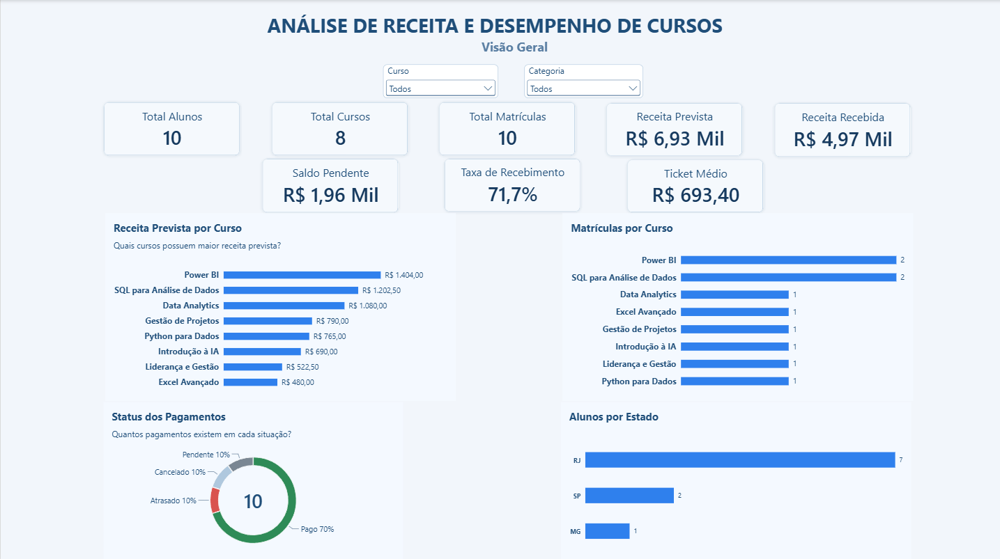
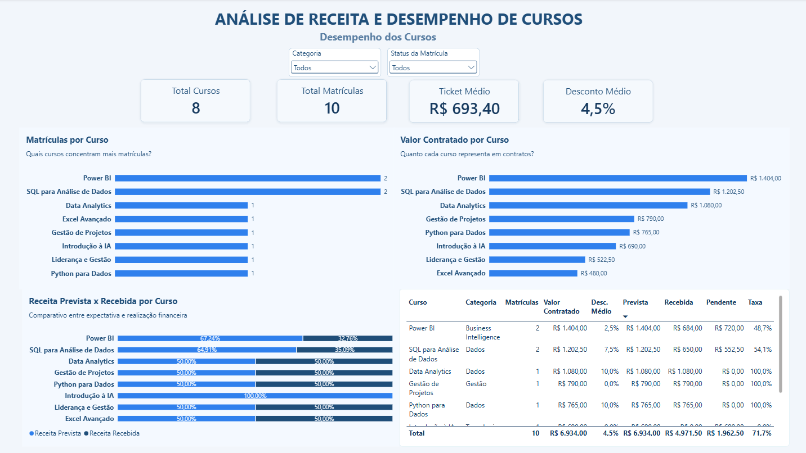
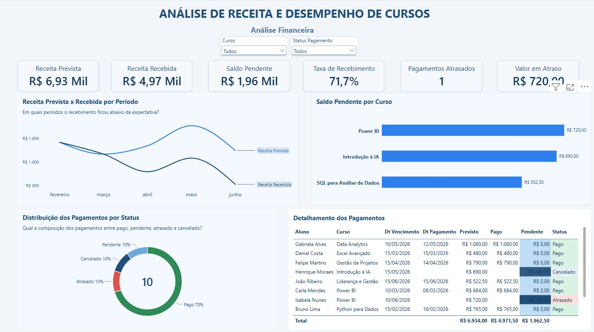
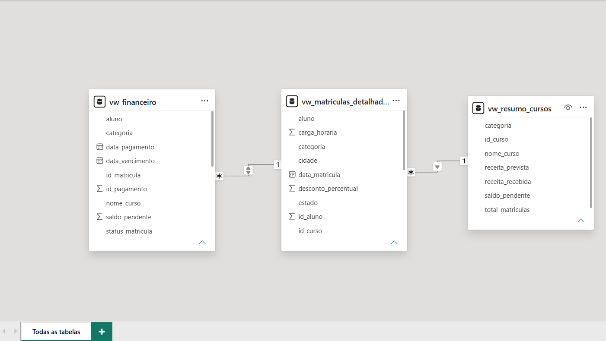

# Análise de Receita e Desempenho de Cursos

Projeto de **Análise de Dados end-to-end** desenvolvido com **PostgreSQL, SQL e Power BI**, cobrindo desde a modelagem de um banco relacional até a construção de um dashboard interativo para acompanhamento de cursos, matrículas e indicadores financeiros.

> Projeto desenvolvido para fins de estudo e portfólio. Todos os dados utilizados são fictícios.

---

## Dashboard

### Visão Geral



A página executiva apresenta os principais indicadores do negócio:

- Total de alunos
- Total de cursos
- Total de matrículas
- Receita prevista
- Receita recebida
- Saldo pendente
- Taxa de recebimento
- Ticket médio
- Receita por curso
- Matrículas por curso
- Status dos pagamentos
- Distribuição dos alunos por estado

---

### Desempenho dos Cursos



Página destinada à comparação entre cursos, permitindo analisar:

- Número de matrículas
- Valor contratado
- Desconto médio
- Receita prevista
- Receita recebida
- Saldo pendente
- Taxa de recebimento
- Categoria
- Status da matrícula

---

### Análise Financeira



Página focada no acompanhamento financeiro:

- Receita prevista x recebida
- Saldo pendente por curso
- Taxa de recebimento
- Pagamentos atrasados
- Valor em atraso
- Distribuição dos pagamentos por status
- Detalhamento dos pagamentos
- Datas de vencimento e pagamento

---

## Visão geral do projeto

O cenário simula uma instituição de ensino que precisa acompanhar o desempenho comercial e financeiro de seus cursos.

A solução foi construída para responder perguntas como:

- Quantos alunos, cursos e matrículas existem?
- Quanto deveria ser recebido?
- Quanto já foi efetivamente recebido?
- Qual é o saldo ainda pendente?
- Qual curso possui maior volume de matrículas?
- Quais cursos representam maior valor contratado?
- Qual é o ticket médio?
- Qual é o desconto médio concedido?
- Quais pagamentos estão atrasados?
- Como os alunos estão distribuídos geograficamente?

---

## Principais resultados

Com base na base fictícia utilizada no projeto, o dashboard apresenta:

| Indicador | Resultado |
|---|---:|
| Alunos | **10** |
| Cursos | **8** |
| Matrículas | **10** |
| Receita prevista | **R$ 6.934,00** |
| Receita recebida | **R$ 4.971,50** |
| Saldo pendente | **R$ 1.962,50** |
| Taxa de recebimento | **71,7%** |
| Ticket médio | **R$ 693,40** |
| Desconto médio | **4,5%** |
| Pagamentos atrasados | **1** |

Os indicadores permitem acompanhar conjuntamente o desempenho dos cursos e a realização financeira dos contratos.

---

## Arquitetura da solução

```text
Dados fictícios
      │
      ▼
PostgreSQL / Neon
      │
      ▼
Modelagem relacional
      │
      ▼
Consultas SQL
      │
      ▼
Views analíticas
      │
      ▼
Power BI
      │
      ├── Power Query
      ├── Modelo de dados
      └── DAX
      │
      ▼
Dashboard
```

### Responsabilidade de cada camada

**PostgreSQL**

- Armazenamento dos dados
- Modelagem relacional
- Integridade referencial
- Relacionamentos entre entidades
- Consultas e agregações
- Criação de views para consumo analítico

**Power BI**

- Modelo analítico
- Medidas DAX
- KPIs
- Segmentações e filtros
- Interatividade
- Visualização dos dados

---

## Modelagem do banco de dados

O banco foi estruturado com quatro entidades principais:

```text
ALUNOS
   │
   │ 1:N
   ▼
MATRICULAS
   ▲
   │ N:1
   │
CURSOS

MATRICULAS
   │
   │ 1:N
   ▼
PAGAMENTOS
```

### Tabelas

| Tabela | Finalidade |
|---|---|
| `alunos` | Cadastro dos alunos |
| `cursos` | Catálogo e características dos cursos |
| `matriculas` | Relacionamento entre alunos e cursos e condições comerciais |
| `pagamentos` | Controle de vencimentos, recebimentos e situação financeira |

Foram utilizadas **Primary Keys** e **Foreign Keys** para garantir consistência entre as tabelas.

---

## Modelo utilizado no Power BI



Para consumo pelo Power BI foram desenvolvidas três views:

### `vw_matriculas_detalhadas`

Consolida informações de:

- alunos
- cursos
- matrículas
- localização
- descontos
- valor contratado
- status da matrícula

### `vw_financeiro`

Consolida:

- aluno
- curso
- matrícula
- vencimento
- pagamento
- valor previsto
- valor recebido
- saldo pendente
- status do pagamento

### `vw_resumo_cursos`

Disponibiliza uma visão resumida por curso com:

- total de matrículas
- receita prevista
- receita recebida
- saldo pendente

---

## SQL desenvolvido

Os scripts foram separados conforme sua finalidade.

### `01_criacao_tabelas.sql`

Criação da estrutura relacional utilizando conceitos como:

```sql
CREATE TABLE
PRIMARY KEY
FOREIGN KEY
REFERENCES
NOT NULL
UNIQUE
DEFAULT
```

---

### `02_insercao_dados.sql`

Carga da base fictícia utilizada no projeto:

```sql
INSERT INTO
VALUES
```

---

### `03_consultas_analiticas.sql`

Consultas utilizadas para exploração e análise dos dados.

Principais conceitos aplicados:

```sql
SELECT
WHERE
AND
OR
IN
BETWEEN
LIKE
ORDER BY
GROUP BY
HAVING
COUNT
SUM
AVG
MIN
MAX
INNER JOIN
LEFT JOIN
CASE WHEN
COALESCE
```

Exemplo de análise de receita por curso:

```sql
SELECT
    c.nome_curso,
    SUM(p.valor_previsto) AS receita_prevista
FROM cursos c
INNER JOIN matriculas m
    ON c.id_curso = m.id_curso
INNER JOIN pagamentos p
    ON m.id_matricula = p.id_matricula
GROUP BY c.nome_curso
ORDER BY receita_prevista DESC;
```

---

### `04_views_powerbi.sql`

Criação das views utilizadas pelo Power BI.

Exemplo:

```sql
CREATE VIEW vw_financeiro AS
SELECT
    p.id_pagamento,
    p.id_matricula,
    a.nome AS aluno,
    c.nome_curso,
    c.categoria,
    p.data_vencimento,
    p.data_pagamento,
    p.valor_previsto,
    p.valor_pago,
    COALESCE(p.valor_pago, 0) AS valor_pago_tratado,
    p.valor_previsto - COALESCE(p.valor_pago, 0) AS saldo_pendente,
    p.status_pagamento
FROM pagamentos p
INNER JOIN matriculas m
    ON p.id_matricula = m.id_matricula
INNER JOIN alunos a
    ON m.id_aluno = a.id_aluno
INNER JOIN cursos c
    ON m.id_curso = c.id_curso;
```

---

## Medidas DAX

Algumas das principais medidas utilizadas no dashboard:

### Total de alunos

```DAX
Total Alunos =
DISTINCTCOUNT (
    vw_matriculas_detalhadas[id_aluno]
)
```

### Total de matrículas

```DAX
Total Matrículas =
DISTINCTCOUNT (
    vw_matriculas_detalhadas[id_matricula]
)
```

### Receita prevista

```DAX
Receita Prevista =
SUM (
    vw_financeiro[valor_previsto]
)
```

### Receita recebida

```DAX
Receita Recebida =
SUM (
    vw_financeiro[valor_pago_tratado]
)
```

### Saldo pendente

```DAX
Saldo Pendente =
SUM (
    vw_financeiro[saldo_pendente]
)
```

### Taxa de recebimento

```DAX
Taxa de Recebimento =
DIVIDE (
    [Receita Recebida],
    [Receita Prevista],
    0
)
```

### Ticket médio

```DAX
Ticket Médio =
AVERAGE (
    vw_matriculas_detalhadas[valor_contrato]
)
```

### Desconto médio

```DAX
Desconto Médio =
DIVIDE (
    AVERAGE (
        vw_matriculas_detalhadas[desconto_percentual]
    ),
    100
)
```

### Pagamentos atrasados

```DAX
Pagamentos Atrasados =
CALCULATE (
    DISTINCTCOUNT ( vw_financeiro[id_pagamento] ),
    vw_financeiro[status_pagamento] = "Atrasado"
)
```

---

## Decisões técnicas

Algumas decisões adotadas durante o desenvolvimento:

- Uso do **PostgreSQL** como banco relacional.
- Hospedagem do banco no **Neon**.
- Administração e validação das consultas pelo **DBeaver**.
- Separação entre camada de armazenamento, preparação e visualização.
- Uso de **Primary Keys e Foreign Keys** para integridade referencial.
- Criação de **views SQL específicas para consumo analítico**.
- Tratamento de valores nulos com `COALESCE`.
- Uso de `DISTINCTCOUNT` para evitar contagens duplicadas no Power BI.
- Uso de `DIVIDE` nas taxas para tratamento seguro de divisão por zero.
- Relacionamentos com direção de filtro controlada no modelo Power BI.
- Padronização visual utilizando uma identidade em azul corporativo.
- Separação do relatório em três perspectivas: executiva, cursos e financeiro.

---

## Tecnologias utilizadas

| Tecnologia | Aplicação |
|---|---|
| **PostgreSQL** | Banco de dados relacional |
| **Neon** | Hospedagem PostgreSQL em nuvem |
| **DBeaver** | Administração e consultas SQL |
| **SQL** | Manipulação, relacionamento e análise dos dados |
| **Power BI** | Modelagem e visualização |
| **Power Query** | Preparação dos dados |
| **DAX** | Medidas e KPIs |
| **VS Code** | Organização dos scripts e documentação |
| **Git** | Controle de versão |
| **GitHub** | Versionamento e apresentação do projeto |

---

## Estrutura do repositório

```text
analise-cursos-sql-powerbi/
│
├── README.md
├── .gitignore
│
├── docs/
│   └── dicionario_dados.md
│
├── imagens/
│   ├── dashboard_visao_geral.png
│   ├── dashboard_cursos.png
│   ├── dashboard_financeiro.png
│   └── modelo_dados.png
│
├── powerbi/
│   └── dashboard_cursos.pbix
│
└── sql/
    ├── 01_criacao_tabelas.sql
    ├── 02_insercao_dados.sql
    ├── 03_consultas_analiticas.sql
    └── 04_views_powerbi.sql
```

---

## Como explorar o projeto

### SQL

Os scripts estão disponíveis na pasta:

```text
/sql
```

A sequência recomendada é:

1. `01_criacao_tabelas.sql`
2. `02_insercao_dados.sql`
3. `03_consultas_analiticas.sql`
4. `04_views_powerbi.sql`

### Power BI

O arquivo do relatório está disponível em:

```text
/powerbi/dashboard_cursos.pbix
```

> Para atualização da fonte original é necessária uma conexão PostgreSQL configurada pelo usuário. Credenciais do ambiente utilizado no desenvolvimento não são disponibilizadas no repositório.

---

## Dicionário de dados

A documentação das tabelas, campos e views utilizadas pode ser consultada em:

[`docs/dicionario_dados.md`](docs/dicionario_dados.md)

---

## Competências demonstradas

Este projeto demonstra aplicação prática de:

- Modelagem de dados relacional
- PostgreSQL
- SQL
- DDL e DML
- Primary Keys e Foreign Keys
- Integridade referencial
- JOINs
- Agregações
- Views
- Tratamento de valores nulos
- Análise financeira
- Power Query
- Modelagem no Power BI
- DAX
- KPIs
- Data Visualization
- Git
- GitHub
- Documentação técnica

---

## Observações

- Todos os dados utilizados são fictícios.
- O banco utilizado no desenvolvimento foi hospedado no Neon.
- Nenhuma credencial, senha ou string de conexão é disponibilizada neste repositório.
- O projeto foi desenvolvido para fins de estudo e demonstração de competências em análise de dados.